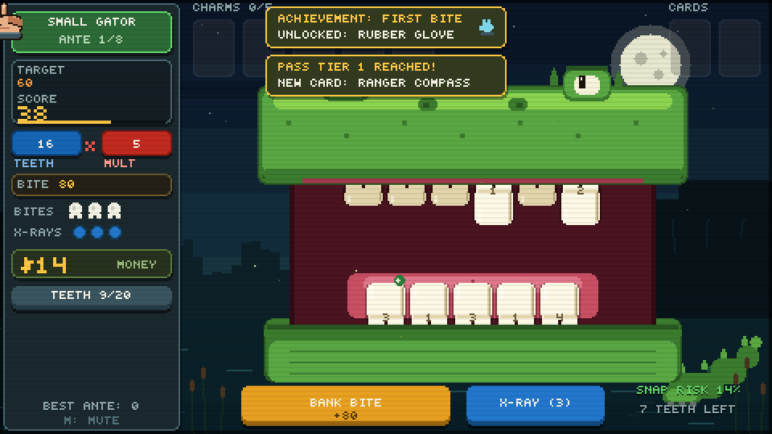

# 🐊 BITE DOWN

**A push-your-luck dental roguelike, set in a living swamp.**

You're a back-bayou dentist with a lantern-lit shop and a very bad idea: press a
gator's teeth one at a time and hope the jaw doesn't slam shut. Every safe tooth
pumps up your **TEETH × MULT** score — but somewhere in that mouth is a **snap
tooth**, and pressing it costs you the whole unbanked bite.

## How to play

Open `index.html` in a browser — that's it. No build, no dependencies, no assets.
(Or serve it: `python3 -m http.server` and visit `http://localhost:8000`.)

### The loop

- **Press teeth** — each safe tooth adds its value to TEETH and grows the MULT chain +1
- **BANK BITE** to lock in TEETH × MULT, or push deeper and risk the snap
- 3 **BITES** and 3 **X-RAYS** per round; reach the target score before you run out
- Climb 8 antes of **Small Gator → Big Gator → Boss Gator**, then Endless Mode

### The swamp is alive

Night sky, moon and fireflies over animated water — the gator sits *in* it.
Clicks ripple the surface, snaps scatter birds from the trees and splash the
water, and boss rounds roll in under a blood moon and rain.

### The gators

Every round type has its own gator, and each of the **11 boss gators** has a look
to match its rule-bend: Loan Shark wears a top hat and taxes your banks, Lockjaw
is bolted into a steel brace, The Restless relocates its snap teeth mid-bite,
the Swamp King wears a crown over a bigger, meaner mouth… and the ante-8
**Apex Predator** is waiting at the end with two snappers and red eyes.

### Cards, charms and the barrel

- **27 CHARMS** (passive powers, 5 slots) and **15 one-shot CARDS**
- **Click any card** for a full-detail view with flavor text
- **Drag cards onto the gator** to use them — EXTRACTION drags onto a single tooth
- **Drag charms into the sell barrel** at the shop to cash them out
- Special teeth (Gold, Ruby, Sapphire, Steel, Lucky, Rotten, Vampire) join your
  tooth deck and show up in future mouths

### Rangers

Pick your ranger before every run:

- **BAYOU SCOUT** — +1 tooth in every mouth, and one tooth per mouth starts X-rayed
- **SWAMP MEDIC** — +1 bite every round, starts each run holding a Novocaine
- **BOG TRADER** — starts with $12 and an interest cap of $8

### The Swamp Pass

Earn **Ranger Points** — achievements pay +25, the three **daily quests** pay
+15 each (they reset at midnight and persist between sessions), and every ante
you beat pays +2. RP climbs an 8-tier pass that drops **new cards into the shop
pool**: the Ranger Compass, Firefly Lantern, Swamp Canteen, Firecracker,
Skeeter Charm, Gator Totem, Hound's Tooth, and the Moonshine Jug.

### Your hand, your gloves

You press with an on-screen pixel hand — and it's customizable. Earn
**achievements** (first press, beating bosses, holding $50, surviving 25 snaps,
clean sweeps, winning a run…) to unlock **8 gloves**, from the humble Rubber
Glove to the Midas Touch and the Royal Grip. Pick yours from the rack on the
title screen.

### Controls

Mouse only. Click teeth and buttons; click cards to inspect; drag cards to act.
`M` mutes. Hover anything for a tooltip.

## Tech

- Single 480×270 canvas scaled with nearest-neighbor for the chunky pixel look
- Everything procedural: hand-rolled 4×5 pixel font, the swamp scene, every
  gator variant, teeth, cards and the hand are drawn from rectangles at runtime
- WebAudio-synthesized sound effects and a little swamp bass groove
- Zero dependencies, zero network, one HTML file + one JS file
