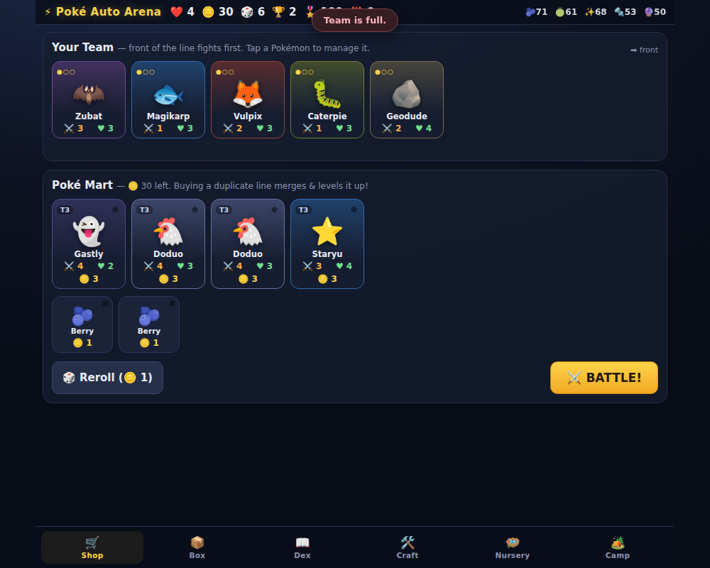

# ⚡ Poké Auto Arena

**A Super Auto Pets-style auto battler crossed with a Pokémon-flavored collect-a-thon idle game.**
Shop, merge, evolve, auto-battle — then throw a ball at the loser's team and keep what you catch.

## Play it

Open `index.html` in any browser — no build, no dependencies, no server.
(Or serve the folder: `python3 -m http.server` → `http://localhost:8000/poke-auto-arena/`.)

Progress saves to `localStorage` automatically. Take your save anywhere with
**Camp → Export/Import**.

## The loop

| Super Auto Pets | Poké Auto Arena |
|---|---|
| Buy pets each turn (10 gold, reroll, freeze) | **Poké Mart** — same economy, plus balls, candy & materials on the side |
| Combine 3 copies → level up | Merging **evolves the line**: 3 copies = Lv2 (Charmeleon), 6 = Lv3 (Charizard). Magikarp is garbage until Lv3… then it's Gyarados |
| Pet abilities | Every line has a **move** (trigger-based, scales with level) *and* a **passive** (Blaze, Sturdy, Static, Moxie…) |
| Plain damage | Full 15-type **effectiveness chart** — Water still drowns Fire |
| 10 wins, 5 lives | Same — 10 wins earns a **League Badge**, then it keeps scaling forever |

## What's new on top

- **🎯 Catching** — after every victory, pick ONE enemy Pokémon and throw balls at it
  (fainted targets are easier; legendaries resist anything but a Master Ball).
  Caught Pokémon live in your **📦 Box** forever and can be deployed into any future run.
- **📖 Pokédex** — 74 species across 38 evolution lines, 5 egg-only legendaries.
  Every new entry pays stardust and permanently boosts your idle income.
- **🛠️ Crafting** — battles/chests/camp drop berries, apricorns, stardust, iron and essence;
  craft Poké→Master Balls, XP candy, and 14 held items (Focus Sash, Leftovers, Quick Claw,
  Choice Band, Rocky Helmet, EXP Share…). One held item per Pokémon.
- **🪺 Nursery** — eggs (15m → 12h) and chests (5m → 6h) tick in **real time**, even with the
  game closed. Better eggs hatch higher tiers; the 12-hour egg is the only place legendaries hatch.
- **🏕️ Camp (idle)** — your collection forages materials while you're away (12h cap), with a
  "welcome back" haul when you return. Trophies from wins buy eggs, chests and nursery slots.
- **Run roguelite** — when your hearts run out, choose one team member to keep in the Box;
  the rest melt into crafting essence. Meta progression survives every run.

## Battle rules (the short version)

Front Pokémon trade simultaneous blows. Moves fire on their triggers (battle start,
on attack, when hurt, on faint, every exchange). Statuses: burn, poison, paralysis,
flinch, curse. First-strikers (Quick Claw / Speedster) deny the counter-hit if they kill.
Battles cap at 80 exchanges — a true stalemate is a draw and costs nothing.

## Tech

- Vanilla JS/CSS, zero dependencies, works from `file://`
- ~74-species data table with per-level move scaling in `js/data.js`
- Deterministic, seedable battle sim (`?seed=N`) decoupled from the animated UI
- Dev/test hooks: `?dev=1` exposes `window.dev` (grant mats, finish timers, etc.)

## Fair-play disclaimer

This is a free, non-commercial **fan project** made for fun and learning.
No official artwork, audio or text is used — all visuals are emoji and CSS.
Pokémon and Pokémon character names are trademarks of Nintendo / Creatures Inc. /
GAME FREAK inc. This project is not affiliated with, endorsed by, or connected to them,
and it must not be sold or distributed commercially.
